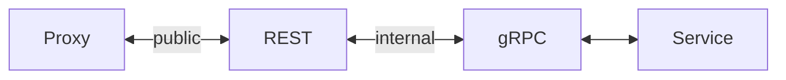

# Three main models for building API
1. REST
2. RPC
3. GraphQL

# RPC (**Remote Procedure Call**)
- 

# gRPC (**Google Remote Procedure Call**)
- Based on RPC
- Use HTTP 2.0 Protocol
- Make data transmission between microservices faster
- Data is passed through ProtolBuf
- Require gRPC-web

# REST (**Representational State Transfer**)
- Response data is passed from BE to clients through JSON or XML message format

# Microservice
- A microservice contains several smaller services that communicate each other by using protocols like HTTP

# API

## 9 best practices
- Using JSON as data format
- Using NOUNS
- Using PLURALS
- Using NESTING
- Error Handling
- Filtering, Sorting, Paging, and Field Selection
- Versioning
- Using SSL/TLS
- Documentation