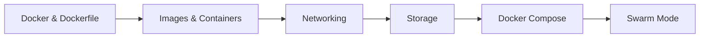
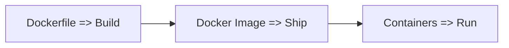
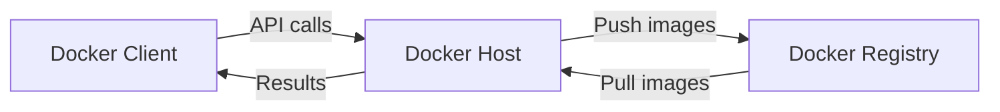

# **Udemy: Learn Hands-on Containerization and Orchestration with Docker Ecosystem (Docker, Compose and Swarm)**
 

# Road map

# Concept
- ### Up to ***application layer***
- ### Flow

- ### Docker Architechture
  - Client: a machine which we use to interact with Docker
    1. via CLI
    2. via API
  - Host: a machine which actually performs tasks of containerization
    - Run docker daemon which listens to and performs actions asked by Docker Client
    - Docker daemon builds Dockfile and turns it into docker image
  - Registry:
    - Serve as a place to store docker images and make them avaliable to others

- ### Docker daemon
  - Manage Docker images
  - Start and stop containers

# Docker & Dockerfile
### Dockerfile
- Sequent set

# Images & Containers
- Each layer apart from the top one is R/O
- The top layer is R/W
- Recognized by name or image ID
- Layers
  - CMD
  - Expose
  - Workdir
  - Run
  - Base image
  - bootfs

# Networking

# Storage

# Docker Compose

# Swarm Mode