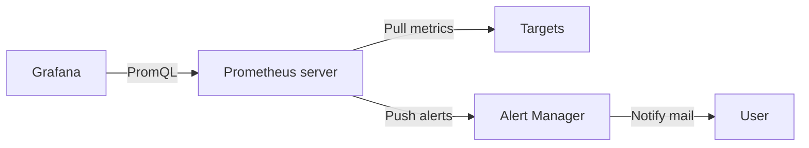

# Prometheus and Grafana

```mermaid
graph LR
	t[Targets]
	p[Prometheus server]
	g[Grafana]
	a[Alert Manager]
	
	p -->|Pull metrics|t
	g -->|PromQL|p
	p -->|Push alerts|a
	a -->|Notify mail|User
```

## Prometheus
- It records real-time metrics in a time series database built using a HTTP pull model.