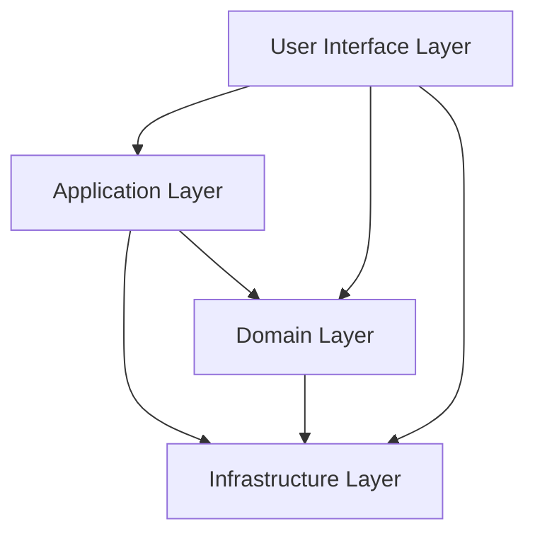

# Domain Driven Design (DDD)

## Basics You Should Know Before DDD
- ### Process based thinking
- ### Forward design
- ### Object-oriented

## Domain Modeling with DDD
- ### Domains, Subdomains & Bounded Context
- ### Context Maps
- ### Entities
- ### Value Objects
- ### Aggregates
- ### Services
- ### Domain Events
- ### Architecture

## 4 Layer Architecture

## Strategic Design & Tactical Design
### Strategic
- Domains, Subdomains & Bounded Context
- Context Maps

### Tactical
- Entities
- Value Objects
- Aggregates
- Services
- Domain Events
- Architecture